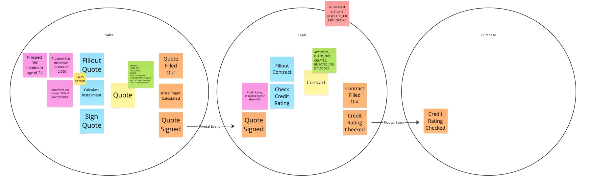

# DDD Lease API

This project is a demonstration of implementing a Lease API using Domain-Driven Design (DDD) principles and Event Driven
Architecture (EDA) with Spring Boot.

## 🧠 Background

This project was implemented following an event storming workshop by [@sadema1](https://gitlab.com/sadema1). The main
purpose is to
learn how to implement an event driven application in combination with DDD and Spring Boot Modulith.

## 🏷️ Event Model

## ✨ Features

- **Domain-Driven Design (DDD)**: Emphasizes the core domain and domain logic, focusing on complex business rules
- **Spring Modulith**: Implements modular architecture to enhance maintainability and scalability
- **Spring Events**: Enables decoupling between different parts of the system by allowing domain events to be published
  and consumed asynchronously, supporting a more reactive and loosely coupled architecture
- **Hexagonal Architecture**: promotes separation between the domain code (DDD) and external concerns, and the ability
  to
  alter the infrastructure or application without touching the domain layer

## 🚀 Getting started

For setup and running instructions, see [run.md](./run.md).

## 📚 Useful Resources

- Miro Board - [Event Storming Lease API](https://miro.com/app/board/uXjVKd959oA=/)
- Sample Application: [Cinema Reservation](https://gitlab.com/sadema1/cinema-reservation)
  by [@sadema1](https://gitlab.com/sadema1)
- Spring Modulith:
    - [Spring Modulith 1.1](https://github.com/coffee-software-show/spring-modulith-1.1) by Josh Long
    - [Spring Modulith](https://github.com/spring-tips/spring-modulith) by Josh Long
- Baeldung Articles:
    - [Organizing Layers Using Hexagonal Architecture, DDD, and Spring](https://www.baeldung.com/hexagonal-architecture-ddd-spring)
    - [Visitor Design Pattern in Java](https://www.baeldung.com/java-visitor-pattern)